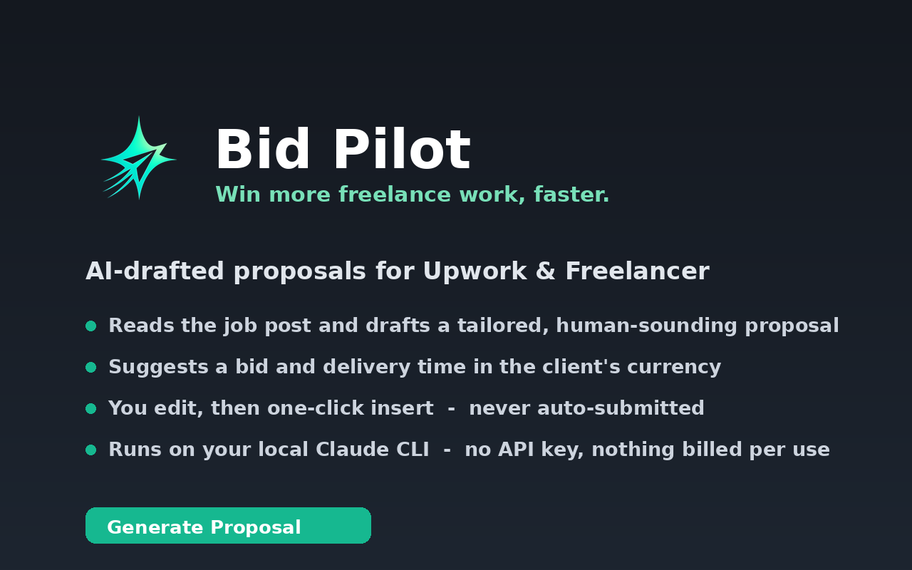

<div align="center">


# Bid Pilot

**An AI copilot for freelance proposals — on Upwork & Freelancer, powered by your local Claude CLI.**

Drafts tailored cover letters, suggests a bid amount and delivery time in the
project's own currency, and fills the form for you to review. It never submits.

[](LICENSE)


[](CONTRIBUTING.md)



</div>

---

## Why

Writing a strong, tailored proposal for every job is slow. Bid Pilot reads the
job post, drafts a proposal in your voice, and one-click fills the form — while
keeping **you** in control of every word and the submit button.

It runs entirely through your **Claude Code CLI**, so there is **no API key and no
per-token billing** — generations are covered by your existing Claude subscription.

## Features

- **Auto-detects** Upwork & Freelancer job/bid pages and shows a floating action button
- **One-click draft** in three styles — Short, Professional, Persuasive
- **Currency-aware bidding** — suggests a bid + delivery time in the *project's* currency, within the client's budget
- **Your voice** — feed a profile, custom standing instructions, and past winning proposals
- **Edit-then-insert** — review and tweak in an editable panel; fills the form, never submits
- **Zero secrets** — auth lives in your local `claude` login; the extension stores no keys and makes no network calls

## How it works

```
 Browser (extension)                                   Your machine
 ┌───────────────────────────────┐                     ┌──────────────────────────┐
 │ content scripts (job page)    │                     │ host-launcher.sh         │
 │   detect → scrape → panel UI  │                     │   (resolves node + PATH) │
 │        │ insert ▲             │                     │        │                 │
 │        ▼        │             │                     │        ▼                 │
 │ background service worker ────┼──── native msg ────▶│ host.js ── spawn ──▶ claude CLI
 │   builds the prompt   ◀───────┼──── JSON ───────────┤   (your subscription)    │
 │        ▲                      │                     └──────────────────────────┘
 │ popup (settings)              │
 └───────────────────────────────┘
```

1. A content script detects a job page and injects the **Generate Proposal** button.
2. On click it scrapes the title, description, skills, budget and currency — **only on demand**.
3. The background worker builds a prompt (profile, style, custom instructions, currency rules).
4. A **Native Messaging host** runs `claude -p --output-format json` locally and returns the draft.
5. You review/edit the proposal + bid + days in the panel, then **Insert** to fill the form.

## Requirements

- Google Chrome, Chromium, or Brave (Linux)
- [Node.js](https://nodejs.org/) on your `PATH`
- [Claude Code CLI](https://claude.com/claude-code) installed and logged in
  (`echo hi | claude -p` should print a reply)

## Install

### 1 · Load the extension

1. Open `chrome://extensions` (or `brave://extensions`)
2. Enable **Developer mode**
3. **Load unpacked** → select the `extension/` folder

### 2 · Run the guided setup (mostly in the browser)

A **setup page opens automatically** on install (or reopen it from the popup →
"Setup / fix connection"). It:

1. **Download installer** — one file, pre-filled with this extension's ID
2. **Run it once** — paste `bash ~/Downloads/bidpilot-install.sh` into a terminal
3. The page **turns green automatically** when connected

> Browsers don't allow an extension to install a native-messaging bridge itself
> (security), so that single downloaded command is the one unavoidable step. It
> drops a small Node host into `~/.bidpilot` and registers it with every
> Chromium-based browser it finds — no repo, no manual IDs, safe to re-run.

**Advanced / scripted:** the repo also ships `native-host/install.sh <EXTENSION_ID>
[chrome|chromium|brave]` if you prefer to install from the source tree directly.

### 3 · Configure

Open the toolbar icon → fill in your profile, pick a default style and model, add any
custom instructions → **Test connection** should report the host is reachable.

## Usage

1. Open an Upwork or Freelancer job / bid page
2. Click the floating **✦ Generate Proposal** button
3. Switch styles, **Regenerate**, or edit the draft directly; adjust the bid / days
4. Click **Insert into form** — then review and submit it yourself

## Settings

| Setting | Purpose |
|---|---|
| Profile | Name, title, skills, experience — grounds the proposal |
| Default style | Short / Professional / Persuasive |
| Model | `claude` model (or CLI default) |
| Tone | Optional tone hint |
| Custom instructions | Standing rules applied to every proposal |
| Past winning proposals | Few-shot examples to match your voice |

## Project structure

```
extension/
  manifest.json
  assets/                 icons + logo
  src/
    content/              page detect, scrape, insert, floating UI
      platforms/          per-site adapters (Upwork, Freelancer)
      ui/                 button + proposal panel
    background/           service worker + native messaging client
    popup/                settings UI
    shared/               storage + prompt building
  setup/                  in-browser guided installer (auto-opens on install)
native-host/
  host.js                 reads stdin frames, runs the claude CLI
  com.bidpilot.host.json  native messaging manifest (template)
  install.sh              registers the host for a browser
  integration-test.mjs    end-to-end smoke test (no browser)
```

## Development

Run the end-to-end pipeline test (prompt → native host → real `claude` → parse) with
no browser:

```bash
node native-host/integration-test.mjs
```

## Contributing

Contributions are welcome — fixing platform selectors when Upwork/Freelancer
change their markup, adding new platforms, or improving the prompt. The
extension loads unpacked with **no build step**. See
**[CONTRIBUTING.md](CONTRIBUTING.md)** for setup, architecture, and how to add a
platform adapter.

## Safety

- **No auto-submit** — Bid Pilot only fills fields; you click submit.
- **No background scraping** — the page is read only when you click Generate.
- **No bulk / automation** — one job, one proposal, one click.
- **No secrets stored** — authentication is your local `claude` login.

## Limitations

- Platform DOM selectors are best-effort and may need patching when Upwork/Freelancer
  change their markup — they are isolated in `extension/src/content/platforms/`.
- Per-machine setup: requires the `claude` CLI installed and logged in locally.
- Each generation spawns the CLI (a few seconds of latency).

## License

MIT
